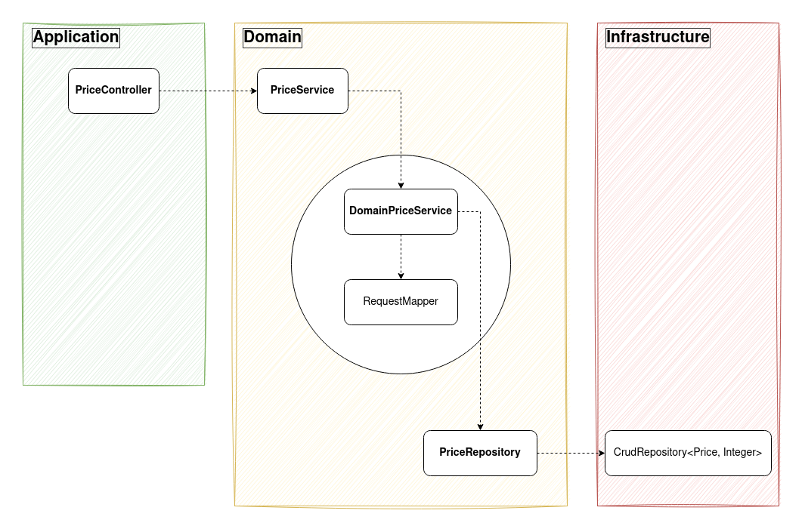
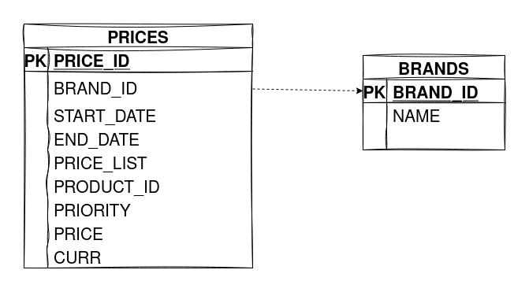
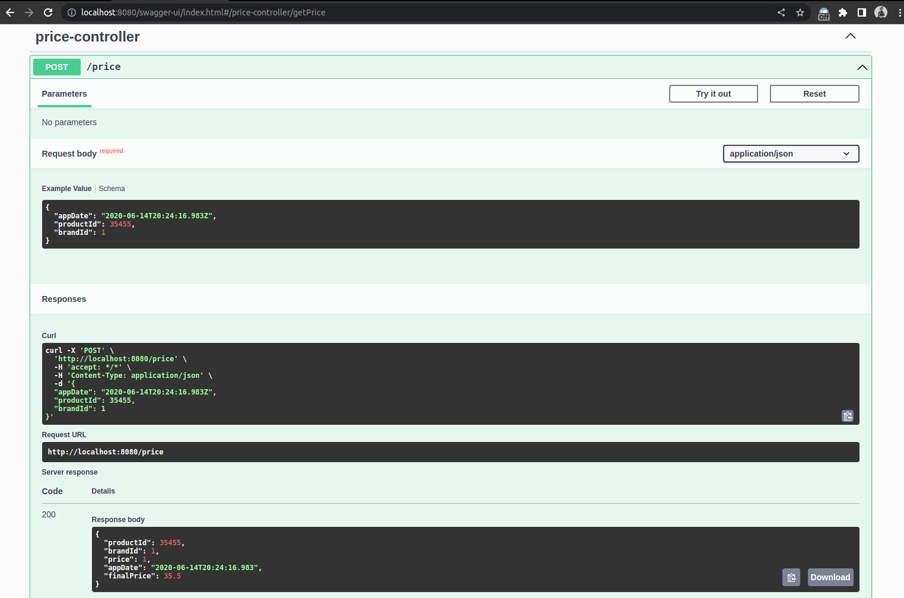

# Precios

En la base de datos de comercio electrónico de la compañía disponemos de la tabla PRICES que refleja el precio final (pvp) y la tarifa que aplica a un producto de una cadena entre unas fechas determinadas. A continuación se muestra un ejemplo de la tabla con los campos relevantes:

### Prices
| BRAND_ID | START_DATE | END_DATE | PRICE_LIST | PRODUCT_ID | PRIORITY | PRICE | CURR |
|----------|------------|----------|------------|------------|----------|-------|------|
| 1 | 2020-06-14 00:00:00 | 2020-12-31 23:59:59 | 1 | 35455 | 0 | 35.50 | EUR |
| 1 | 2020-06-14 15:00:00 | 2020-06-14 18:30:00 | 2 | 35455 | 1 | 25.45 | EUR |
| 1 | 2020-06-15 00:00:00 | 2020-06-15 11:00:00 | 3 | 35455 | 1 | 30.50 | EUR |
| 1 | 2020-06-15 16:00:00 | 2020-12-31 23:59:59 | 4 | 35455 | 1 | 38.95 | EUR |

### Campos

| Nombre | Descripcion |
|--------|-------------|
| BRAND_ID | foreign key de la cadena del grupo (1 = ZARA). |
| START_DATE,END_DATE | rango de fechas en el que aplica el precio tarifa indicado. |
| PRICE_LIST | Identificador de la tarifa de precios aplicable. |
| PRODUCT_ID | Identificador código de producto. |
| PRIORITY | Desambiguador de aplicación de precios. Si dos tarifas coinciden en un rago de fechas se aplica la de mayor prioridad (mayor valor numérico). |
| PRICE | precio final de venta. |
| CURR | iso de la moneda. |

### Se pide

Construir una aplicación/servicio en SpringBoot que provea una end point rest de consulta  tal que:

* Acepte como parámetros de entrada: fecha de aplicación, identificador de producto, identificador de cadena.
Devuelva como datos de salida: identificador de producto, identificador de cadena, tarifa a aplicar, fechas de aplicación y precio final a aplicar.

* Se debe utilizar una base de datos en memoria (tipo h2) e inicializar con los datos del ejemplo, (se pueden cambiar el nombre de los campos y añadir otros nuevos si se quiere, elegir el tipo de dato que se considere adecuado para los mismos).

* Desarrollar unos test al endpoint rest que  validen las siguientes peticiones al servicio con los datos del ejemplo:

| Test | Detalle |
|------|---------|
| 1 | Petición a las 10:00 del día 14 del producto 35455   para la brand 1 (ZARA) |
| 2 | Petición a las 16:00 del día 14 del producto 35455   para la brand 1 (ZARA) |
| 3 | Petición a las 21:00 del día 14 del producto 35455   para la brand 1 (ZARA) |
| 4 | Petición a las 10:00 del día 15 del producto 35455   para la brand 1 (ZARA) |
| 5 | Petición a las 21:00 del día 16 del producto 35455   para la brand 1 (ZARA) |


### Arquitectura (Hexagonal)
La lógica del dominio se concreta en el core del negocio, al que llamaremos "Domain", siendo el resto partes exteriores. El acceso a la lógica del dominio desde el exterior está disponible a través de puertos y adaptadores.
Con este enfoque, podemos intercambiar fácilmente las diferentes capas de aplicación / infraestructura.


### Estructura de carpetas del proyecto
```sh
├── application
│   └── port
│       └── in
│           └── rest
│               └── PriceController.java
├── Application.java
├── domain
│   └── prices
│       ├── DomainPriceService.java
│       ├── mapper
│       │   └── RequestMapper.java
│       ├── PriceService.java
│       ├── request
│       │   └── PriceRequest.java
│       └── response
│           └── PriceResponse.java
└── infrastructure
    ├── adapters
    │   └── out
    │       └── jpa
    │           ├── entity
    │           │   ├── Brand.java
    │           │   └── Price.java
    │           └── repository
    │               └── PriceRepository.java
    └── config
        └── exceptions
            ├── ControllerAdviceBase.java
            └── ProblemDetailBase.java
```

### Diseño de base de datos


```sh
INSERT INTO BRANDS (BRAND_ID, NAME) VALUES (1, 'ZARA');
INSERT INTO PRICES (PRICE_ID, BRAND_ID, START_DATE, END_DATE, PRICE_LIST, PRODUCT_ID, PRIORITY, PRICE, CURR) VALUES (1, 1, TIMESTAMP '2020-06-14 00:00:00', TIMESTAMP '2020-12-31 23:59:59', 1, 35455, 0, 35.50, 'EUR');
INSERT INTO PRICES (PRICE_ID, BRAND_ID, START_DATE, END_DATE, PRICE_LIST, PRODUCT_ID, PRIORITY, PRICE, CURR) VALUES (2, 1, TIMESTAMP '2020-06-14 15:00:00', TIMESTAMP '2020-06-14 18:30:00', 2, 35455, 1, 25.45, 'EUR');
INSERT INTO PRICES (PRICE_ID, BRAND_ID, START_DATE, END_DATE, PRICE_LIST, PRODUCT_ID, PRIORITY, PRICE, CURR) VALUES (3, 1, TIMESTAMP '2020-06-15 00:00:00', TIMESTAMP '2020-06-15 11:00:00', 3, 35455, 1, 30.50, 'EUR');
INSERT INTO PRICES (PRICE_ID, BRAND_ID, START_DATE, END_DATE, PRICE_LIST, PRODUCT_ID, PRIORITY, PRICE, CURR) VALUES (4, 1, TIMESTAMP '2020-06-15 16:00:00', TIMESTAMP '2020-12-31 23:59:59', 4, 35455, 1, 38.95, 'EUR');
```

### Propiedades (application.yaml)
```sh
spring:
  datasource:
    username: janez
    url: jdbc:h2:mem:testdb
    driverClassName: org.h2.Driver
    password: janez
  jpa:
    database-platform: org.hibernate.dialect.H2Dialect
    hibernate:
      ddl-auto: create
```

### Requisitos

- Java 17
- Maven ^3

### Iniciar

mvn spring-boot:run

### Compilar

mvn package

```sh
Results :

Tests run: 0, Failures: 0, Errors: 0, Skipped: 0

[INFO]
[INFO] --- maven-jar-plugin:3.3.0:jar (default-jar) @ platform-ecommerce ---
[INFO] Building jar: /home/janez/workspace/zara/target/platform-ecommerce-0.0.1-SNAPSHOT.jar
[INFO]
[INFO] --- spring-boot-maven-plugin:3.0.2:repackage (repackage) @ platform-ecommerce ---
[INFO] Replacing main artifact with repackaged archive
[INFO] ------------------------------------------------------------------------
[INFO] BUILD SUCCESS
[INFO] ------------------------------------------------------------------------
[INFO] Total time:  3.210 s
[INFO] Finished at: 2023-02-28T11:18:49-05:00
[INFO] ------------------------------------------------------------------------
```

### Test

mvn test

```sh
Results :

Tests run: 6, Failures: 0, Errors: 0, Skipped: 0

[INFO] ------------------------------------------------------------------------
[INFO] BUILD SUCCESS
[INFO] ------------------------------------------------------------------------
[INFO] Total time:  1.169 s
[INFO] Finished at: 2023-02-28T11:20:47-05:00
[INFO] ------------------------------------------------------------------------
```

### OpenAPI definition

http://localhost:8080/swagger-ui/index.html



### Sonar Cloud
https://sonarcloud.io/project/overview?id=janezmejias_challenge-prices